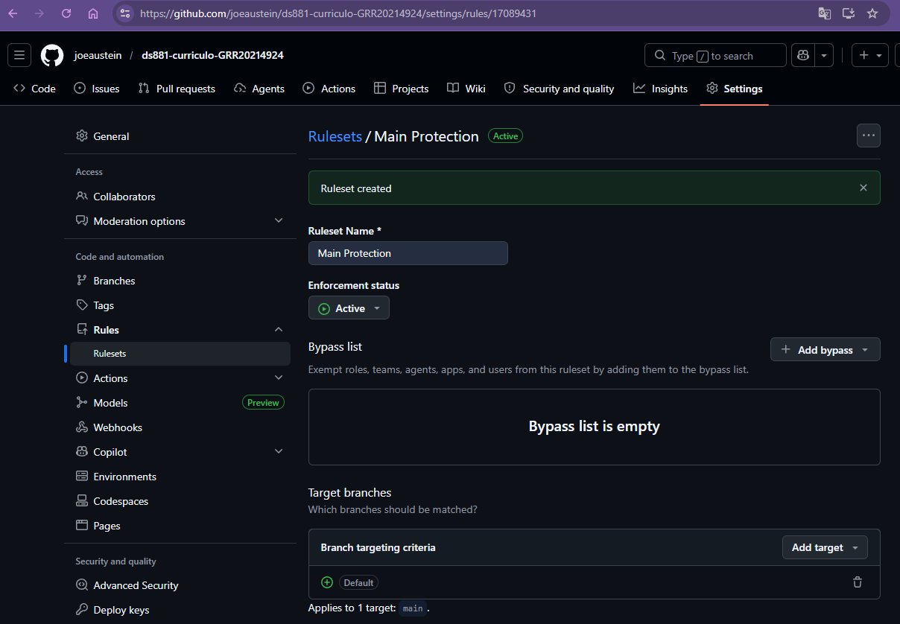

# Projeto Individual: Currículo Online DS881

Este repositório é um **template** para a atividade prática individual da disciplina DS881. O objetivo é aplicar conceitos de conteinerização, automação de pipeline CI/CD e governança de código em um cenário de projeto real (seu currículo ou portfólio profissional).

## Instruções para Início

Para iniciar o seu trabalho, siga estes passos:

1. Clique no botão verde **"Use this template"** e selecione **"Create a new repository"**.
2. Nomeie o repositório como `ds881-curriculo-GRR99999999`.
3. Certifique-se de que a visibilidade seja **Public**.
4. Configure a proteção da branch `main` imediatamente (instruções na seção 2.2).

---

## 1. Objetivo
Desenvolver e publicar um currículo profissional ou portfólio pessoal utilizando o GitHub Pages. O projeto deve demonstrar o domínio de ferramentas de conteinerização, automação de pipeline CI/CD e governança de código via fluxos de trabalho estruturados, mesmo em um ambiente de desenvolvimento individual.

## 2. Requisitos Técnicos

### 2.1. Tecnologia e Stack
* **Aplicação:** O site deve ser estático. É livre a escolha entre HTML/CSS puro ou o uso de geradores de site estático (SSG) como Astro, Hugo ou Jekyll.
* **Hospedagem:** O deploy final deve ser realizado obrigatoriamente no GitHub Pages.

### 2.2. Conteinerização do Ambiente de Desenvolvimento (Docker)
O repositório deve fornecer a infraestrutura necessária para que o projeto possa ser editado e testado localmente sem a exigência de instalar as linguagens ou dependências base (como Node.js ou Ruby) no sistema operacional do hospedeiro.
* **Dockerfile:** Deve especificar uma imagem base adequada (ex: `node:alpine` ou `ruby:alpine`) e preparar o ambiente com as ferramentas necessárias para executar o gerador de site estático escolhido.
* **Docker Compose (`docker-compose.yml`):** Deve ser configurado para iniciar o servidor de desenvolvimento nativo da ferramenta (ex: `vite dev`, `jekyll serve` ou `hugo server`).
* **Mapeamento de Volumes (Bind Mounts):** A configuração do Compose deve mapear o diretório local do código-fonte para o diretório de trabalho dentro do contêiner. Isso é obrigatório para garantir o funcionamento do *hot reload* (atualização automática no navegador ao salvar um arquivo).
* **Portas:** O servidor de desenvolvimento dentro do contêiner deve ser mapeado para responder na porta `8080` do localhost da máquina hospedeira.

### 2.3. Workflow de Git e Governança
Apesar de ser um projeto individual, o projeto deve seguir as boas prática do desenvolvimento com git:
* **Proteção de Branch:** A branch `main` deve estar configurada como protegida nas configurações do repositório.
* **Fluxo de Trabalho:** É proibido realizar *push* direto na `main`. Toda alteração deve ser feita em uma branch secundária (ex: `feat/nome-da-feature`) e integrada via **Pull Request (PR)**.
* **Critérios de Merge:** O merge para a `main` só deve ser permitido se o pipeline de CI estiver com status "verde" (sucesso).
* **Mensagens de Commit:** Devem seguir o padrão *Conventional Commits* (ex: `feat:`, `fix:`, `ci:`, `docs:`).

### 2.4. CI/CD (GitHub Actions)
Implementação de um workflow automatizado (`.github/workflows/main.yml`) contendo:
1.  **Linter/Static Analysis:** Verificação de sintaxe e padrões de código.
2.  **Build:** Validação de que a aplicação compila corretamente dentro do ambiente de CI.
3.  **Deploy:** Publicação automatizada no GitHub Pages disparada após o merge na branch `main`.

## 3. Documentação
O arquivo `README.md` deve conter:
1.  Link público do currículo em produção.
2.  Instruções detalhadas para execução do ambiente local via Docker.
3.  Prints ou descrição da configuração de proteção da branch `main` aplicada no GitHub.

## 4. Critérios de Avaliação

| Item | Peso |
| :--- | :--- |
| Configuração correta de Docker (Dockerfile e Compose) | 30% |
| Pipeline de CI/CD funcional (Lint, Build e Deploy) | 30% |
| Evidência de uso de Pull Requests e Branch Protection | 20% |
| Qualidade da documentação e histórico de commits | 10% |
| Funcionamento da aplicação no GitHub Pages | 10% |


---

## 5. Entrega e Avaliação

A entrega deve ser realizada através do formulário disponibilizado pelo professor, contendo o link do seu repositório público.

---

> **Atenção:** Não esqueça de anexar no final deste README ou na documentação do projeto um print comprovando que a regra de **Branch Protection** da `main` foi configurada no GitHub.

## 6. Main Protection Config



### Rules:
Restrict updates;

Restrict deletions;

Require a pull request before merging;

Block force pushes.

---

**Como executar localmente (Docker)**

1. Construa a imagem e inicie o serviço com Docker Compose:

```bash
docker-compose up --build
```

2. Abra `http://localhost:8080` no navegador. O container usa `live-server` e observação de arquivos para recarregamento ao salvar.

**Executar sem Docker (opcional)**

Pré-requisito: Node.js instalado localmente.

```bash
npm install
npm run start
```

**Deploy no GitHub Pages (CI/CD)**

O workflow está em `.github/workflows/main.yml`. Ao fazer merge na branch `main` o pipeline:
- Roda o linter (`npm run lint`)
- Executa o build (`npm run build`) que gera a pasta `dist`
- Publica `dist` no GitHub Pages automaticamente
 - Publica `dist` no GitHub Pages automaticamente

**Link público (preencher após o primeiro deploy)**

Insira aqui a URL pública do currículo (ex.: https://USERNAME.github.io/REPO_NAME). Após o primeiro merge para `main` e deploy bem‑sucedido, copie a URL e cole neste campo.

**Como executar localmente — instruções detalhadas (Docker)**

Pré‑requisitos: instale Docker Desktop (Windows) ou Docker Engine + Docker Compose.

Comandos úteis:

```bash
# Inicia em primeiro plano (útil para desenvolvimento e ver logs)
docker-compose up --build

# Inicia em segundo plano (detached)
docker-compose up --build -d

# Ver logs do serviço
docker-compose logs -f

# Parar e remover containers
docker-compose down
```

Observações:
- O Compose monta o diretório do repositório em `/app` dentro do container (bind mount), portanto alterações locais são refletidas imediatamente e o `live-server` faz hot reload.
- O servidor de desenvolvimento responde em `localhost:8080` do host.

**Branch Protection — descrição e evidência**

Requisitos: a branch `main` deve ter proteção que **requira PRs** e **exija checks do CI antes do merge**. Passos resumidos:

1. Acesse _Settings_ → _Branches_ → _Branch protection rules_ → _Add rule_.
2. Em _Branch name pattern_ coloque `main`.
3. Ative _Require a pull request before merging_.
4. Ative _Require status checks to pass before merging_ e selecione o check do workflow (ex.: `build`).
5. (Opcional) Ative _Include administrators_ para aplicar a regra a administradores também.

Evidência (adicionar ao repositório):
- Faça uma captura de tela da tela de regras de proteção mostrando que `main` tem as opções ativadas.
- Coloque a imagem em `docs/branch-protection.png` e adicione um link nesta README apontando para esse arquivo.

**Checklist resumido — onde verificar**

- `index.html`: página estática com o currículo.
- `css/style.css`: estilos básicos.
- `Dockerfile`: imagem base `node:18-alpine` com `live-server` — expõe `8080`.
- `docker-compose.yml`: bind mount do repositório para `/app` e `8080:8080`.
- `package.json` / `.htmlhintrc`: linter (`htmlhint`) e scripts (`npm run lint`, `npm run build`, `npm run start`).
- `.github/workflows/main.yml`: workflow CI com lint, build e deploy Pages.

> Observação: para que o CI apareça como opção em _Require status checks_, execute o workflow pelo menos uma vez (p.ex. abrindo um PR com mudanças) — só então será possível selecioná‑lo na lista de checks.


